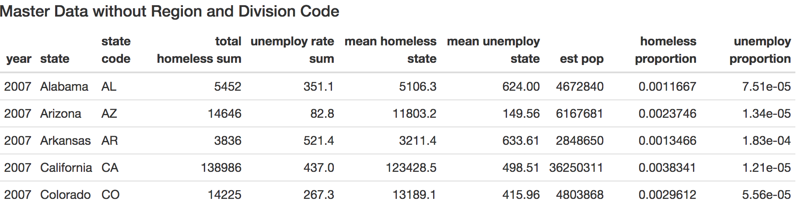

# Relation between Homeless and Unemployment 
***
Is there a relationship between homelessness and unemployment rate?

This repository contains all the R files that were produced to clean up mutiple csv files 
and a master csv file for visualization purpose; including identify the relationship using 
visualization technique. 

##### The Result of Each File will Produce

1. [Homeless_work file](https://github.com/linhly2012/FinalProjectSOC225/blob/master/Final%20Project%20225/homeless_work.R)
      +  
    
2. [Unemployment_work file](https://github.com/linhly2012/FinalProjectSOC225/blob/master/Final%20Project%20225/unemployment_work.R)
      +  

3. [Homeless_unemploy_clean file](https://github.com/linhly2012/FinalProjectSOC225/blob/master/Final%20Project%20225/homeless_unemploy_clean.R)
      +  

4. [Pop-work file](https://github.com/linhly2012/FinalProjectSOC225/blob/master/Final%20Project%20225/pop-work.R)
      +  

5. [Avg-work file](https://github.com/linhly2012/FinalProjectSOC225/blob/master/Final%20Project%20225/avg-work.R)
      +  

6.  [Joint_data_work file](https://github.com/linhly2012/FinalProjectSOC225/blob/master/Final%20Project%20225/joint_data_work.R)
      + 

7. [Graphing file](https://github.com/linhly2012/FinalProjectSOC225/blob/master/Final%20Project%20225/Graphing.Rmd)
      + Plot 1:  
      + Plot 2: 
      + Plot 3: 
      
##### Final Result of the Table
 